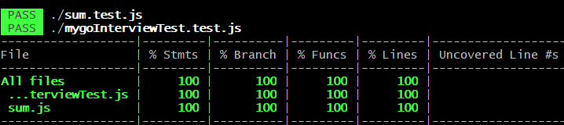

## 簡介

這是一個 myGo 面試題的原始碼，包含一個面試題目及 JEST unit test 測試。

## 環境設定

1. 安裝 JEST  
   `npm install --save-dev jest`

2. 設定 package.json 以啟動 JEST test

```js
{
  "scripts": {
    "test": "jest --coverage" //會產生 coverage 報告
  }
}
```

## 測試

1. 啟動 JEST test，會回傳測試結果及涵蓋率報告  
   `npm run test`

2. 測試結果  
   
